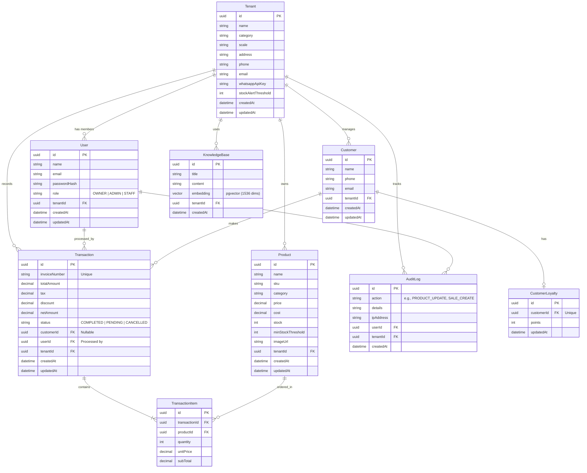

# Entity Relationship Diagram (ERD)

This document contains the ERD for SmartBiz AI. Below is the database relationship diagram in Mermaid format.

## Description of Relations

1. **Multi-Tenancy Isolation**:
   - `Tenant` is the root entity. All entities (`User`, `Product`, `Customer`, `Transaction`, `AuditLog`, `KnowledgeBase`) reference a `tenantId`. Every database query is scoped to this ID.

2. **RBAC Control**:
   - The `User` table has a `role` field restricted to `OWNER`, `ADMIN`, or `STAFF`.

3. **Customer & Loyalty Program**:
   - A `Customer` has a one-to-one relationship with `CustomerLoyalty`. Points are accumulated based on transaction amounts and saved there.

4. **Sales Ledger**:
   - A `Transaction` is logged by a `User` (the cashier/staff/admin) and optionally linked to a `Customer` (for CRM and loyalty). It consists of multiple `TransactionItem`s, which connect to individual `Product`s.

5. **AI RAG (Knowledge Base)**:
   - The `KnowledgeBase` table stores business manuals, policies, or product information, including high-dimensional vector embeddings to support semantic queries in the AI assistant.
